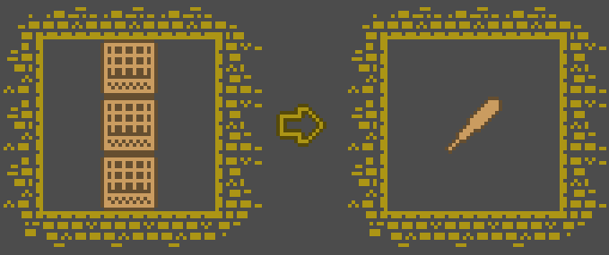
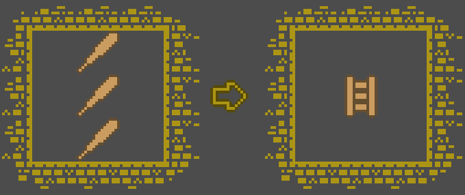

+++
title = "Devlog for Miz Jam 1"
date = "2020-08-25"
author = "Mike Lezhnin"
tags = ["gamedev", "devlog"]
+++

I recently participated in a light-core [game jam](https://itch.io/jam/miz-jam-1) made by Miziziziz. It was 48 hours
throughout a week to make a game, where everyone was obliged to use the same art-pack. Here is my
[game](https://mike239x.itch.io/motherships-factory) btw. Below is the devlog, later I will make a post on interesting
bugs I had, another one on some nice things I learned, and a third one with just some side-notes.

### Day 1
I looked at the provided tileset and damn that thing is huge! It has 47x22=1034 tiles of a size 16x16. I decided I want
to use as many tiles in my game as I could. The two ideas on what kind of game I would like to make were as follows: 1)
a 2D clone of [Townscaper](https://store.steampowered.com/app/1291340/Townscaper/) or 2) a game in the style of
[Zachtronics](http://www.zachtronics.com/), something with the player having to create production lines following some
rules.

I quickly realized that version 1 is not gonna happen - building above first floor would be impossible, so the
end-result would not be interesting; so version 2 it is then.

Zachtronics always has some sort of fusing thing on the level that one has to reuse to build things, so I decided to
make something similar. I made it so my game is 15x9 tiles, and decided that a dedicated 3x3 area would be "the crafting
box" - something I blatantly stole from Minecraft. I also made a UFO that would move items around.

### Day 2
Implemented the UFO, it can now grab/drop items. Implemented the crafting box. Added whole bunch of items.

### Day 3
Made the crafting recipes for whole bunch of items. Started making a scene where one can see all available recipes. The
recipes I made were also pretty much stolen from Minecraft. You could make wood/stone/iron swords/axes/pickaxes,
leather/iron armor, shields, arrows, bows. You could process trees to get wooden planks, and then use those to craft
whole bunch of wooden things - doors, beds, and so on.

### Day 4
I decided it is time to make some actual levels to the game. I decided to make 4 levels -
forest/beach/mineshaft/furnace.  I made forest level and the master level, which would allow user to move between the
levels.

### Day 5
That day was a complete mess. I understood that - as is - my game will end up *really* boring. The thing is, it is not
hard to just follow a recipe and create a thing, but it takes quite some time to put the ingredients together - so
the main "puzzle" of the game ends up being both easy and slow to do, making it unbearable.  I got depressed and did
nothing the entire day.

### Day 6
I did some thinking. I realized I was still lacking the "production line" part of the game. I had in mind some idea -
that if you make a cycle with the UFO it would create a drone that would start repeating the actions you made, so one
would be able to set-up drones so that they create one and the same item all the time. This looked like the "production
line" I wanted, but went quite against the level design I got by that time - having only 4 levels meant I can't really
make more than 4 production lines, which is very little, plus I didn't really have any item generators - all resources
were created from natural things lying around the world, and it would look really weird if trees and stones would
instantly respawn after you take those away; but without item generators it would make the creation of "production line"
much more annoying.

The conclusion was to delete the levels I made and start again. This time levels were strictly separate, with well
defined spawn locations and drop spots for results. I spent a while trying to come up with a way to spawn those drones
in a way that will be somewhat intuitive. I ended up with this: you can move an item **X** from point **A** to point
**B**, and that will create a drone, that would move items of type **X** from point **A** to point **B** directly
following the path you took, then going back using the same path. This was both easy to code and easy for the player to
understand.

I also addressed the issue of difficulty. Let's take a look at an example.  Three wooden planks make a stick:

And three sticks make a ladder:

Given two crafting boxes one can easily use one to create sticks, and another to create ladders. Easy. Looks nice, but
still easy to do. Now imagine we give the player only one crafting box. Now the player should do two different crafts in
just one box, alternating between those without clogging the box. Thankfully, with the way I designed the drone
deployment this harder level was doable, though it is much harder to complete. Nice, now we got some complexity in the
game.

I made a whole bunch of levels + removed some "boring" crafts, such as all the armor and weapons based on minecraft.

### Day 7
With levels done I spent a while polishing the game - I added all the menus, added transitions between menu screens,
added transitions between levels, buttons to change game speed, etc.  I built the game and submitted it.  Woohoo.

### Conclusion

Overall, the game turned out somewhat junky, but also - the way all the drones move together to make things is really
satisfying.  I kinda managed to make what I intended to make from the beginning, even though the gamedev process had a
few unexpected turns here and there.

There are a few things I wish I improved:
1) Add some sounds - at least some nice background music
2) Add counter to show level progress - how many items player produced
3) Add an extra teaching level that would explain (somewhat) how to
do the hardest puzzles in the game
4) Fix an annoying bug where items can get jammed into each other.

